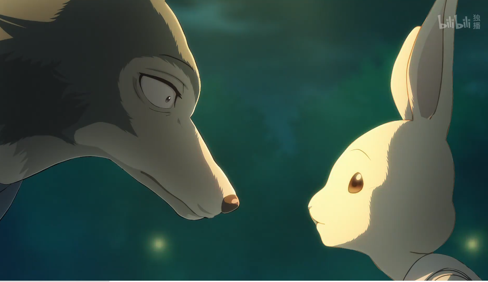
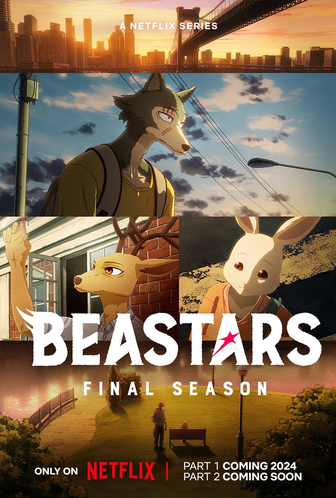

# 愛的自我效能
## 2025/1/5 更

現在回顧回去這個時間點，發現自己完全陷入了「依賴陷阱」。我跟她似乎陷入了你追我跑的狀態，我越追，她就會越想躲開。這是身為「焦慮依附」與「逃避依附」相處不健康的寫照。我將原先的心情筆記修飾，希望保留我的焦慮心情，並可以有更流暢的閱讀。

現在的我可以理解，她和我人生的軌道並不相同，她亦沒有視我為人生的隊友。在我面臨焦慮的時刻，我們沒有任何正面溝通的機會，沒有一起解決的可能性。因此正確的選擇是放下、離開，並等待、尋找和你走在相同人生方向的人。

## 我的心情筆記

我的心情真的好複雜，因為我這樣焦慮的感受就是來自於妳。我真的好想跟妳多相處一點，但妳當下就忘記了我的存在了，我再度陷入聯絡不到妳的世界，妳選擇逃進沒有我的世界。

這個感覺就像是在水中，聲音好小，我的感官被毫無限度地放大。內在的聲音如廣播般在腦袋中迴響

> 好想跟她相處，快點傳更多訊息，快點聯絡她

我傳訊息了，但是仍然是聯絡不到妳，於是我又墜入更深的海裡，準備好要窒息。隔晚我真的受不了了，又傳了一次訊息給妳。想跟妳要一個承諾、一個一定聯絡的到妳的方式。

妳選擇視而不見。

---

或許我不應該再自私的搶奪妳的時間，這只會扼殺我們的關係。即使妳表現的不以為意，然而我的負面能量已經充斥著整個聊天室。這是個負面迴圈，如果我再這樣下去，有一天妳會不願意再打開我的訊息。

**「我需要多休息」**

**「我心情不好」**

我不喜歡一直想著妳的我，因為我會覺得我又哪裡做不好，讓妳又漠視我。更重要的是，我希望妳快樂，希望妳跟我相處是放鬆的。然而，最終我的存在好像讓你更不快樂了，這讓我覺得好痛苦。

> 我只是累了，我只是心情不好

---

睡一覺後，瞬間我就清醒了。

瞬間我就可以把想妳的念頭和聯絡妳的行為切開，知道怎麼樣符合我們兩人的最佳利益。我也取回了我自己的主控權，因為焦慮暫時已經聽我的話了。雖然還是有點懷疑，甚至有點害怕再次碰到妳，我的焦慮會不會控制不住，又傷害妳了呢？讓我想到 BEASTARS 的劇情。我這樣掙扎的感覺，或許就跟雷格斯對哈魯的喜歡夾雜著垂涎的食慾。而妳對我的感受，是不是也夾雜著草食動物對肉食動物的恐懼呢？

## 心理學筆記

針對為什麼

> 我只是累了，我只是心情不好

會成立？

有沒有可能是其他的可能呢？

## 自我效能理論

關於[自我效能理論](https://en.wikipedia.org/wiki/Self-efficacy)，班杜拉告訴我們，有四個因素影響著自我效能，也就是自己做不做得到的信念：

- **成功經驗**（Mastery experience）：**最重要的因素**，當你對相關事件有成功的經驗時，你就更容易相信你做得到
- **替代經驗**（Vicarious Experience）：看到跟你類似的人也辦到了，那你也會傾向於認為自己做得到（他都做到了，我一定也可以）
- **社會說服**（Social Persuasion）：直接鼓勵或是勸阻會有很大的影響（通常負面的影響更大，會使你更不相信自己）
- **激發**（Arousal）：生理或是情緒的激發，無論是顫抖、疲倦，還是心情上的難過、恐懼，都可能讓我們認為是無能的展現，影響對自己能力的評估。

而對我來說，她對我之前的回饋是我的**成功經驗**，我知道她對我的感受，還有我們想處的互動；我**看著朋友和其他人的幸福**，我相信自己也值得幸福的關係；朋友和家人也都在旁**鼓勵**我，不會時不時講幹話說別肖想了。

那問題是什麼？

> 我只是累了，我只是心情不好

這是非常真實的感受，即使沒有嚴格的論證和嚴謹的實驗。我知道我已經耗費太多認知資源了，甚至有點喪失時間的感覺。也更容易陷入難過的情緒，擔心自己是不是做錯了，對方才不理會我。

但真的不是。

或許我是真的累了，要好好休息一下！

|| 期待一下 BEASTARS Final Season ||

