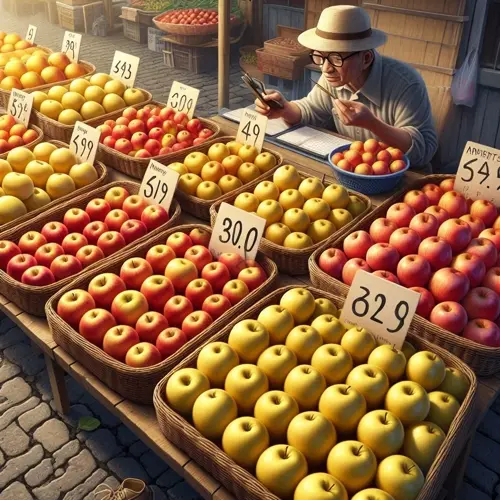
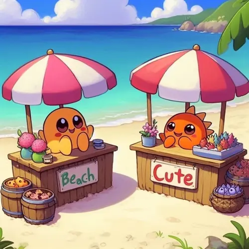

# 民主的本質與中間選民

最近台灣民主受到很大的挑戰。

我不禁覺得民主是這麼脆弱的嗎？沮喪之際，剛好看到[志祺七七和葉浩教授的訪談](https://www.youtube.com/watch?v=bbrbY5cCZM4)，讓我有許多啟發。除了點出民主的本質外，也很好的說明了現在的處境。

## 民主的本質

在結尾，志祺七七提問：我們如何調解台灣內部的嚴重分裂，打造出屬於台灣的共同故事？葉浩教授這樣說：

> 最後一件事情就是補課，好好地認識民主。
>
> 民主它就是解決衝突的機制。
>
> 民主是由人民來選出來的，選出來的人會**直接反映大部分選民的素質、想法**。人民的素質、想法越高，民主選出來的人才會越優秀。
>
> 民主就是這一種平庸的、不上不下、勉強大家可以運作（的模式）。所以你不要對民主期待過高，正視民主是什麼，降低期待是運作民主最好的一種方法。

要怎麼理解這段話呢？我們可以用一個統計的小小例子。

### 市場買蘋果

今天如果你去市場跟阿伯買蘋果，你看到桌上有超過 20 顆蘋果。你可以看到有些蘋果光澤明亮，有一些感覺已經黯淡無光，但大部分賣相一般般。你就隨口問了一下：

> 阿伯，今天這批蘋果如何？

阿伯想都不想回答：

> **絕對讚的啦！**要幾顆我幫你選。

你就回答了：

> 那幫我選幾顆**普通**的就好，要算我便宜一點的。

於是乎，你看到阿伯就從大部分一般般的蘋果中拿了幾顆幫你打包起來，當然他也是給你打了個折。

**現在問題就來了**：

你明明看到有一些不一樣品質的蘋果，但很明顯一開始問的時候阿伯刻意**高估了蘋果的平均價值**。但在挑選的時候，能夠**代表這一整堆蘋果的**，很明顯就是**普通品質**的那些。

### 平均數在哪裡？

現在我們知道問題在哪了，葉浩教授所說的就是這個道理。民主是代表**大多數人**，如果眾多的蘋果品質都普普通通，那當然我們品質的平均就是普普通通。

終究「高品質」和「低品質」的是少數。我們可能跟阿伯一樣期望蘋果的品質普遍是高的，那就必須從源頭改善蘋果樹的種植、蘋果的採摘、物流，確保蘋果在交到消費者手中是漂亮的。

第一步，我們要認知到：民意代表就是負責代表大部分人民的想法，這不一定是你的想法。但光知道到這件事就非常有幫助了。

知道「平均數」在哪裡。

## 中間選民定理

民意代表一定是代表「多數民意」嗎？有沒有可能人民選出了一個不符合多數民意的民意代表？有一個政治經濟學理論就回答了這個問題—那就是 Duncan Black 提出的[中間選民定理](https://en.wikipedia.org/wiki/Median_voter_theorem)（Median voter theorem）。

想像一個情境：

### 沙灘上的攤販

現在在一個沙灘上，沙灘上只有兩個攤販：一個在最右邊、一個在最左邊。

現在一名顧客來到了沙灘的正中間，他很渴，想要買個飲料。他發現兩邊的攤販差不多遠，但天氣實在太熱了，他只想要**快點買到一杯飲料**。所以就隨便選了一間。假設右邊好了。

左邊的老闆就想：那我是不是靠近中間一點，下次顧客就會來我這邊。

果然，後來出現在中間的顧客看到左邊的攤販比較近，因為實在太熱了，所以就直接去了左邊的攤販。

這時候右邊的老闆發現不對勁，他發現顧客都因為左邊的攤販離中間比較近，所以選擇了左邊。為了不要繼續損失顧客，他把攤販移到離中間更靠近的地方。新來的顧客看到右邊的攤販比較近，所以就都往右邊去。

### 擠在中間

你發現了嗎？最後兩邊的老闆會因為不想錯過任何顧客，不斷的向中間移動。最後的結果就是兩個攤販都在**沙灘的正中間**[^1]。

（最後兩家店的老闆就會近到可以跟彼此打招呼了）

中間選民理論也是如此，候選人會為了吸引更多的選票，會往中間靠攏，**選擇一個多數人會支持他的立場**。這也是為什麼每次選舉，好像每個候選人的政策都有很多重複的地方。（當然會不會實現是另一回事了）

[^1]: Hotelling's law https://en.wikipedia.org/wiki/Hotelling%27s_law
