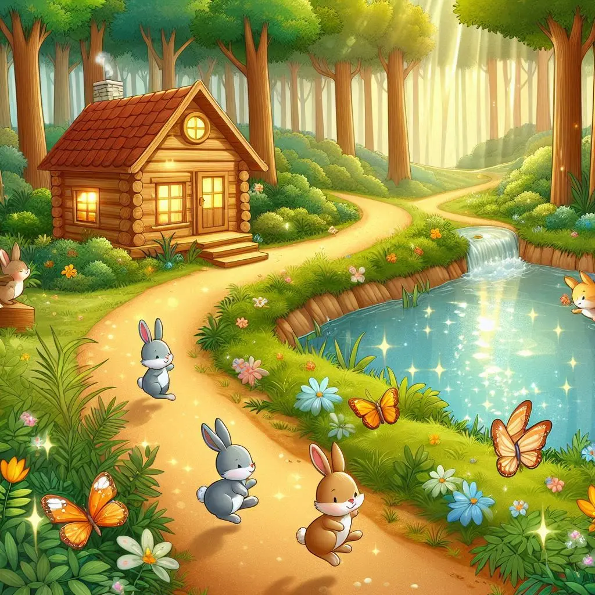
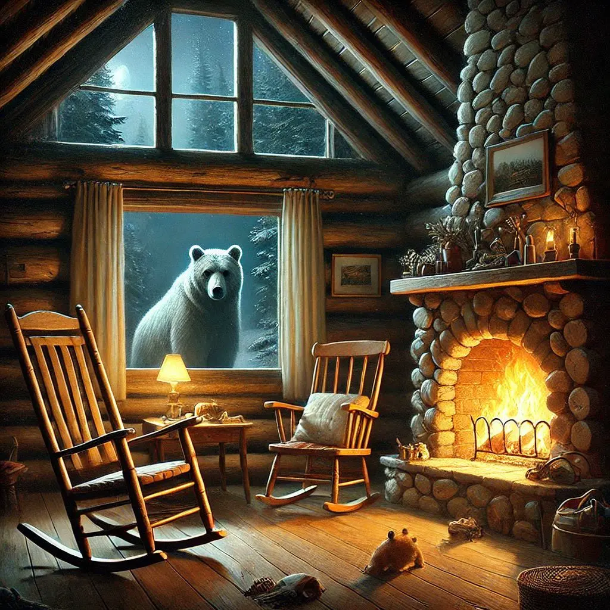
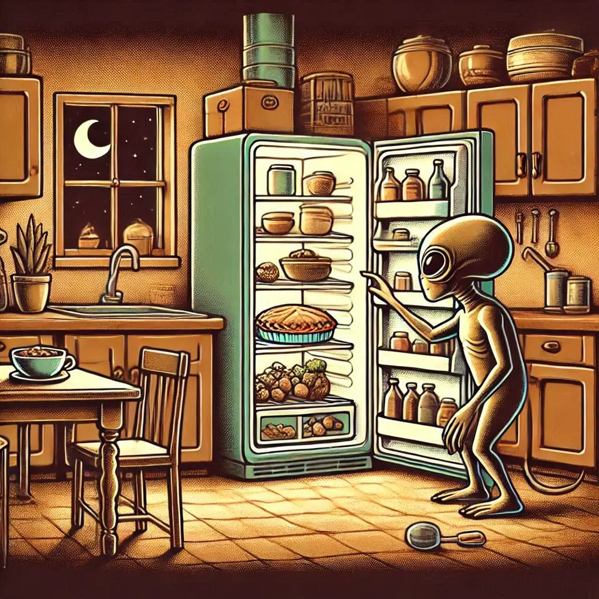
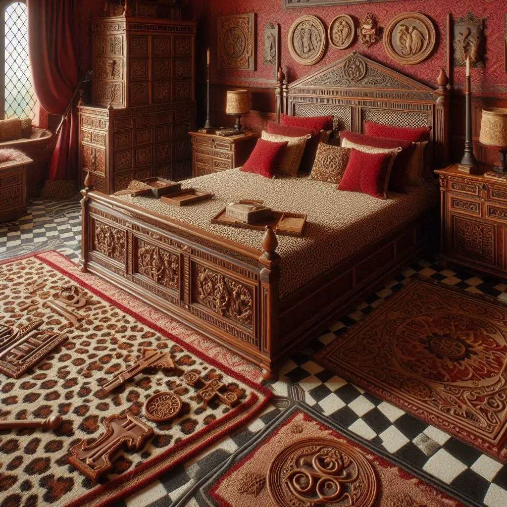
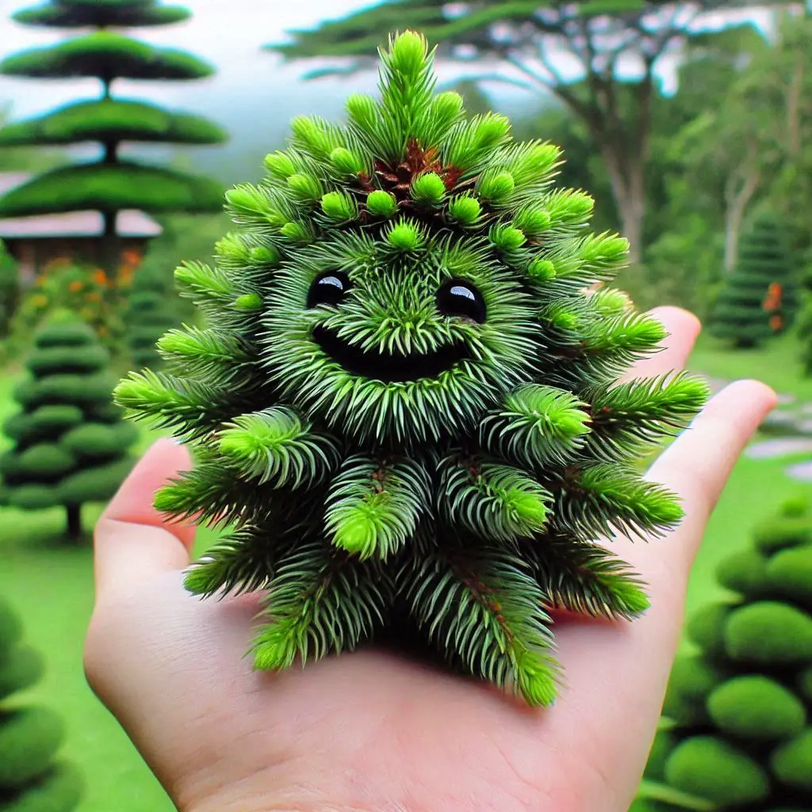

# 元辰宮與走進森林

不知道大家有沒有做過「走進森林」（Walk into the Woods）測驗，通常起手式都是如此的：

> **問題**：
> 你走進一片森林，這條路看起來是怎樣的？

- 平坦、蜿蜒還是崎嶇不平？
- 森林周圍的環境是茂密還是稀疏？

接下來會有一連串的問題（由於測過就會有預期，所以如果有興趣可以自己搜尋），透過一些心裡的投射了解自己的個性或是內心的匱乏與恐懼。

然而今天我要分享的「元辰宮」冥想，竟然意外的讓我跳回高一時體驗「走進森林」的情境中。

究竟什麼是「元辰宮」呢？

## 靈魂的住所

### 元辰宮是什麼？

**元辰宮**是源自東方玄學與心理學的一種「心靈探索與自我認識」的方法，結合了冥想與象徵意象的引導，讓人透過內心深處的想像場景，探索自我潛意識的狀態。

而元辰宮被形容為**靈魂的住所**，象徵一個人的內在世界。這個世界中，有著代表安全感、情緒、生命能量等不同面向的元素。

### 元辰宮的探索方式

元辰宮的探索過程通常藉由冥想或引導式的內觀，讓自己進入一個寧靜的心境，透過具象化的場景，透過「自由」想像引導中的各種場景，以觀看自己的情緒狀態、過往經歷或未來願景。

所以跟「走進森林」這個很類似，只是每個人想像的「元辰宮」可能截然不同，例如：

- 皚皚百雪的深山
- 荒涼的沙漠
- 紅土的外星球...

每個場景可能反應了冥想者的不同狀態，除了讓人深入了解自己的內心需求，也能幫助釐清情緒、解開過去的心結，帶來療癒和安定感。進而提供一個安全而有深度的自我對話空間，發現自己在面對困難時以及自我和解的內在力量。

## 我的體驗

那說說我的元辰宮吧！為何我要提到「走進森林」呢？不僅兩者都算是投射測驗，也可能可以達到類似的效果。因為我發現，進入深度冥想後：

> 我再度回到這座森林的入口

事後我問 ChatGPT 為何會這樣，它說很可能是因為我過去做過「進入森林」，因為在當時輔導老師的引領，讓我熟悉森林和小屋這些意象和「安全感」、「成長」、「歸屬感」
等的連結。因此在元辰宮冥想中，這些象徵很自然地浮現出來，幫助我更快地與內在世界連結。

讓我覺得蠻酷的，因為明明每個人的元辰宮差異很大，我卻自動回到了我熟悉的意向系統中。然而元辰宮冥想卻比「走進森林」更自由，我可以隨著內心的感覺走，形成自己的故事。因此只有開頭類似「走進森林」，後面更像是一場自由的心靈探索。

以下就是我的元辰宮冥想[^1]：

### 1. 走進森林：探索之始

在一片靜謐的森林中，我沿著一條小路緩緩前行。這條路看起來輕鬆且平坦，讓人感到自在。

路邊生氣盎然——可愛的小兔子在跳躍，蝴蝶翩翩飛舞，帶來了一種輕盈的氛圍。遠方，一座小屋映入眼簾。陽光灑落在屋頂，閃爍著柔和的光芒，旁邊還有一座波光粼粼的湖泊，水面微微閃爍，彷彿在低語著什麼。

### 2. 遇見熊的凝視

在這片平靜的景象中，我注意到好幾隻熊佇立在不遠處。牠們似乎在觀察著我，表情帶著一絲奇怪的神情。

我有些遲疑——牠們是想要傷害我，還是只是純粹的好奇？我決定保持距離，不試圖去觸碰，但內心還是充滿疑問：「為什麼牠的表情如此複雜呢？」我感覺牠們隨時要衝過來，就像 123 木頭人般，會不會在我背對牠時就突然出現在我背後呢？

儘管牠們看似威脅，我依然感到安全——這是我的小屋前方，我的世界。這裡的一切，終究無法真正傷害我。

### 3. 小屋之內

當我走進那棟屬於我的小木屋時，感到了一股溫暖。

屋內有一個壁爐，火光搖曳，帶來了舒適的氣息。旁邊有一張柔軟的搖椅，窗戶可以看到外面的景象——那隻熊仍在注視。

我拉上窗簾，讓視線不再交會。即使拉上窗簾，小屋依然光亮無比，那份亮光來自於內在，而非外界。我輕嘆一口氣——雖然我感覺被注視，但我努力讓自己專注在這份平靜中。

### 4. 廚房的場景

突然壁爐旁伸展出一條迴廊，末段是我的廚房，樣貌就跟我舊家[^2]的廚房一樣。

這個廚房有點單調，顏色偏青銅色，看似平凡無奇。

有一個大小中等的冰箱，但卻塞滿了東西——滿到讓人覺得需要清理。我下定決心丟掉那些不需要的食物，冰箱瞬間變得空曠、清爽，讓人感到輕盈。

奇怪的是，廚房裡出現了一個外星人，正忙著打掃。牠似乎想要幫助我，卻無法理解我的話語。我開始想像自己在這裡煮湯，慢慢地燉煮出濃郁的味道，為我愛的人準備美味的料理。烤箱裡的派散發出香氣。

我心裡想：如果廚房能變得更繽紛，或許會更有活力。

### 5. 房間的探索

接著，我來到了房間。這間房間的風格古色古香，帶著中世紀的氣息。地上鋪著帶有棕色與白色花紋的豹紋地毯。床也是豪華的中世紀造型的，上面有兩顆枕頭，但躺上去時，卻感覺有些不合適。

我觀察房間的四周，發現有許多中世紀浮雕的家具，彷彿歷史的遺物。這些物品雖然有質感，但也帶來了一絲沉重與陌生感。雖然不至於生灰塵，房間仍然透著外面的光線，但似乎有種孤單的色彩。

我抬起頭，發現我的床尾正對著化妝桌和鏡子。然而鏡子壞了，我看不見自己的倒影。

我來到衣櫃前，打開後卻發現裡面是空的，沒有一件衣服。我心想：「為什麼這個空間看似屬於我，卻又讓我感到陌生呢？」

#### 6. 後花園

我離開了房間，腳步移向後院。

打開後門後，一片無邊無際的草原展現在我眼前，近處有許多的花朵，遠處隱約可見高聳的山脈。

森林在我的後方，只看得到零星幾棵樹，大多被我的小屋和柵欄擋住了。熊群聚集在森林中，他們似乎往我這邊看，但卻無法前往，甚至沒辦法看到這裡。

### 7. 生命之樹

在後花園的中央，我看見了一株針葉樹。不，這不是普通的樹，而是一個帶著微笑的小精靈。祂只有我的手掌大，閃閃發光，充滿生命力的跳躍著。這個小精靈蹦跳著，跳到我的手心上，枝葉輕輕騷動，祂笑得好開心。

我忍不住泛起淚光，輕輕將它靠在臉頰上，感受到那份純粹的溫暖。

## 元辰宮分析

接下來的分析才是重點！

大致上元辰宮就是由以下的階段構成：

1. 探索之始：這個階段通常象徵著內心的「探索與自我開放」以及「外人如何看待你」。
2. 房子內部：通常象徵「安全感」、「歸屬感」，顯示自我保護與情緒安全
3. 廚房：通常象徵「情感與物質支持」
4. 房間：通常象徵「自我認同」與「親密關係」
5. 後院：通常象徵「未來與成長空間」
6. 生命之樹：通常象徵「核心信念與內在力量」，亦表示內在精神力量與自我療癒能力

以下是 ChatGPT 替我分析我的元辰宮。

整體而言我覺得相當準確，我們就一步一步看吧！

### 1. 森林小徑與湖泊

1. **森林中的道路**：象徵你在人生中探索的方向，輕鬆的小徑暗示你目前的路途雖然有挑戰，但並不沉重，而是充滿好奇和期待。
2. **兔子與蝴蝶**：兔子象徵純真和敏感，而蝴蝶象徵轉變與自由。它們出現在你的道路上，意味著你在前行的過程中渴望輕鬆愉快，同時擁有蛻變與新生的力量。
3. **湖泊的反光與熊**：湖泊象徵情緒和潛意識，反光的感覺說明你對**情緒世界的覺察力很高**。但熊出現時，你感受到一種矛盾，既害怕被傷害，但也覺得牠沒有敵意。熊通常象徵**力量和自我保護**意識，這可能意味著你對未知或人際互動的「防禦心」與「包容心」在拉扯。

### 2. 小屋與窗簾

1. **木屋象徵內心的庇護所**：你的小屋是你內心的安全空間。木頭材質象徵自然與質樸，你的內心深處其實渴望平靜與安全感。
2. **窗簾**：你選擇拉下窗簾，這意味著你希望隔絕來自外界的干擾與注視，甚至「不去看」那些威脅或負面的情緒。這是一種保護自我、不被情緒牽動的機制。窗簾雖然拉下，但仍有光亮表示即便你試圖讓自己屏蔽外界，你的內心仍然保有光芒和溫暖，這顯示你有強大的內在力量，不會被孤獨或恐懼完全吞噬。

### 3. 廚房、冰箱與外星人

1. **生活中的滋養與照顧自己**：廚房象徵你的「情感滋養」與「關照內心世界」的能力。廚房雖然明亮，但色調單一，這可能說明你在生活中需要更多的色彩與變化，甚至尋找新的刺激來豐富日常。
2. 冰箱「滿到溢出」的狀態
    - **象徵情感累積**：冰箱代表你儲存的**情感記憶和生活經驗**，裡面有太多的「過去情感、記憶或未消化的事情」，導致過滿甚至無法容納新的東西。
    - 這可能暗示你在情感世界中，有太多**尚未釋放或放下的情緒負擔**，因此需要「整理和清空」，為新的體驗和關係騰出空間。
3. 外星人幫忙打掃卻聽不懂你說的話[^3]
    - 外星人象徵一種**陌生或不熟悉的力量**，這可以是你內在尚未熟悉的一部分，也可能是來自外界的干擾。
    - 它「幫你打掃」卻「聽不懂你說的話」，顯示你雖然嘗試整理情緒或尋求幫助，但這些幫助並不是完全符合你內心需求的，甚至有時顯得格格不入。這可能提醒你：需要更了解自己的需求，避免**過度依賴外在的標準**。
4. 烹飪行為：代表你願意投入時間「滋養」自己或他人。你願意煮香噴噴的湯和做派，象徵願意對在意的人付出與愛

### 4. 房間的中世紀風格與空衣櫃

1. **中世紀元素與古老的風格**：這顯示出你對於某些舊有信念或生活模式有著深刻的依賴，但同時也可能讓你感到「過於沉重」或「難以突破」。
2. **紅棕色調和自然光線**：象徵中性帶暖的情感狀態，偏向於平穩但仍缺乏生氣。這可能暗示你目前的生活雖然安穩，在情感層面上有些**孤單與冷淡**，但仍希望有更多的溫暖。但房間內依然有「自然光線」，說明你內心有希望和力量，這份光芒讓你不至於陷入完全的黑暗與孤獨。
3. **床的柔軟與不合適的感覺**：床象徵「休息與放鬆」，但你在躺下時覺得不太合適，這意味著你渴望休息，但可能在心境上無法真正放鬆。你或許正在努力適應某種新的生活方式，但目前仍有些不習慣或找不到完全契合的狀態。
4. **空衣櫃**：象徵「身份的未完成或重塑」。衣櫃是存放你「身份象徵」的地方，沒有衣服意味著你可能正處於一個「過渡期」，顯示出你對「下一步要扮演的角色」仍有些不確定感。
5. **鏡子**
   - **鏡子正對床**：床是你休息和放鬆的地方，象徵最放下防備、最真實的自我。鏡子正對床代表**你時時刻刻在審視自己**，即便在你最脆弱、最無防備的時刻，你仍會不自覺地「觀察和檢視自己」。鏡子正對床也可能象徵**你如何看待自己在親密關係中的角色**。你可能時常反思：「我在這段關係中表現得足夠好嗎？」「我是被愛和被認同的嗎？」當你躺在床上時，這面鏡子像是另一個你在觀察和提醒你，而當鏡子無法反射出影像時，這也許是你對於自己在親密互動中感到迷失，或者是害怕看見自己的「脆弱一面」。
   - **鏡子壞了，無法看見自己**：當你在冥想中看向鏡子，卻看不到自己，這可能象徵你正處於一個**對自我認同感模糊或質疑**的階段，試圖尋找「真正的自己」。

### 5. 後花園的平原

1. 無盡的平原象徵「無限的可能性與自由」
    - 平原象徵著**開闊的心境**與**無限的選擇**，當你面對一片無邊無際的平原時，代表你內心對未來的發展抱有許多可能性。這也意味著你擁有很大的**選擇權**與**自由**。你有能力去決定自己的方向，而不是被現實環境局限。
    - 平原的「無盡」也可能代表著你內心深處對「探索自我」和「未來旅程」的渴望與憧憬。
2. 山脈象徵「**目標與挑戰**」
    - 山脈在非常遙遠的地方，象徵你對未來目標的追求或人生高峰的渴望，但目前你選擇的是觀望而非攀爬。
    - 山脈的距離說明：你對自己設定的目標**相對長遠**，你並不急於馬上攀登，而是希望透過沉穩的步伐慢慢前進。這樣的畫面代表你對**成長與目標抱持著耐心**，可能需要更多時間來累積力量，等到自己覺得準備好了，再向目標出發。
3. 後花園作為內在世界的象徵
    - 這片後花園是你的專屬天地，是讓你感到安靜、安全的地方。它是無邊無際的，說明你對生命抱持著**開放和包容的態度**。
    - 這片花園是與外界區隔的，這說明你需要**內在的空間**來整理自己的心情和思緒，這是一種高度自主與內在反思的表現。

### 6. 生命之樹

1. **針葉樹的象徵**：堅韌與持續生長
    - 針葉樹通常象徵持續的生命力與永恆的綠意，因為它四季常青，不易凋謝。這意味著你內心有著一種**持久而不易動搖的生命力**，即使面對風雨或挑戰，你依然有內在的韌性和力量。
    - 這種形象也代表著你內心**對穩定與陪伴的渴望**，希望能有一份始終如一的連結，就像針葉樹不因季節變化而失去綠意一樣，你渴望長久的支持和關懷。
2. **小精靈的形象**：純真、希望與生命的萌芽
    - 小精靈是一個帶著微笑的可愛形象，充滿了童心與純真的特質。它象徵你內心深處那份**純潔**、**真誠**與**對生命的熱愛**。
    - 小精靈在你手掌心跳動，說明這份生命力與你非常親近，代表你**擁有創造、保護與滋養生命的力量**。它提醒你，即使有時感到疲憊或迷茫，你內心深處依然有這份純真的希望與光芒。
3. **微笑與在手掌心上跳動**
    - 這個針葉樹小精靈帶著微笑，說明你內心有一種強烈的**自我接納**與**自我療癒**的力量。這個微笑可能是你內心深處的聲音，提醒你：「無論發生什麼，你都是被愛的，你值得擁抱生命的美好。」
    - 當你把它靠近臉頰時，這是一種**愛與親密的象徵**，代表你渴望被愛與接納，也願意用自己的溫柔去關愛自己與他人。
    - **手掌**象徵著「行動與掌控」，而生命之樹在你手掌心上跳動，代表你擁有**掌握自己生命力量的能力**，這是一份「能夠照顧與支配自己生活方向」的象徵。它在你手中「跳動」，說明這股力量是靈動且充滿活力的，提醒你：「你的生命力不僅僅是堅韌，而是充滿了溫暖、創造力和動能。」
4. **為什麼你會感到感動到哭？**
    - 當你將生命之樹的小精靈靠在臉旁時，你感受到一股來自內在深處的純粹愛與溫暖，這是一種「**被愛和被看見**」的深層情感流露。
    - 這份感動與眼淚象徵你**願意接受自己的脆弱與真實情感**，並且從中獲得力量。它提醒你：「真正的力量來自於接納自己的柔軟，而不是一味的堅強。」

## 從始至終的注視

> 似乎從始至終我都感覺被注視（包括熊或是不知名的眼神），令我十分害怕。這可能代表什麼？

我這樣問 ChatGPT，它這樣跟我說的：

> 在元辰宮冥想中，**被注視的感覺**往往象徵著**內在對自我價值的評估、他人的眼光、以及不安與恐懼的投射**。當你提到在冥想過程中時常感受到「被注視」甚至「害怕被注視」，這是一個值得深入探討的訊號，因為這樣的情景通常會反映出內心深層的需求與擔憂。

1. 自我批判與外界評價的焦慮
    - 你可能習慣在生活中「感覺到他人的目光」，這些「目光」不一定是實際的評論，而是你心中對**他人期待與評價**的投射。
    - 熊與不知名的眼神象徵了你對於**外界壓力**、**未知情況**的敏感。即使無人真正批評你，但你會感受到來自無形世界的一種「審視」。你**害怕自己被否定、被拒絕，或者覺得自己無法符合某些標準**，這讓你在與他人的互動或自我成長中感到不安。
2. 自我防禦機制的啟動
    - 熊是森林中力量的象徵，但在冥想中，它的存在帶有矛盾：牠既不敵意、又讓你心生恐懼。這可能象徵你的**自我防禦機制**在啟動，但你又害怕過度防禦會讓你失去與外界連結的機會。
    - 被注視的感覺像是時刻準備戰鬥，說明你內心有一種對自我保護的渴望，但這種「持續準備」也帶來了**疲憊**和**不安**。
    - 不知名的注視和多隻熊的存在，意味著你對「未知的變化」感到抗拒或恐懼。你可能害怕無法掌控情況，擔心事情會朝著你無法預期的方向發展，因此時刻保持警戒，生怕有什麼「突如其來」的變故。
3. 害怕打開內心，卻又渴望被接納
    - 小屋是你安全的象徵，但你在小屋內依然感受到「被注視」，這顯示出你內心對**脆弱與保護之間的掙扎**：
    - 你希望有一個絕對安全的空間，但又擔心即便進入這個空間，也無法完全逃避這些「審視」。當你選擇拉下窗簾，是希望「看不見這些眼神」，但內心深處你也知道，「他們仍然在那裡」，這反映出你的**不安全感來源於內在**，而非外界。

## 冒險回顧

在冥想的過程中，由於我開著錄音，一邊講下我看到的一切，所以能夠完整紀錄。有點可怕的是，冥想後當晚我時不時有被注視的感覺，好像有一雙眼一直看著我。

後來睡前我回想了元辰宮的經歷，我想像那注視的雙眼露出了身體：

> 那是我自己，那時候我看到我自己正在笑著

我覺得就像是前面分析的，我對於自己的要求十分的嚴苛，對於外界的刺激也相當敏感。也因此使我時不時感覺到「被注視」的不安全感。其實絕大部分的注視是來自於自己，因為大家都忙著關注自己。

或許要抓住安全感的第一步，就是能夠對自己微笑吧！

很有趣的體驗！完整的錄音紀錄我會[放在這](https://bloggermandolin.com/docs/article/psychology/tests/walk_into_the_woods_record)。

[^1]: 圖片利用 https://www.bing.com/create 生成
[^2]: 我在約小六的時候和家人搬離原先的住屋處，並搬入現在的家
[^3]: 也有可能我[膽大黨](https://acg.gamer.com.tw/acgDetail.php?s=136657)看太多
